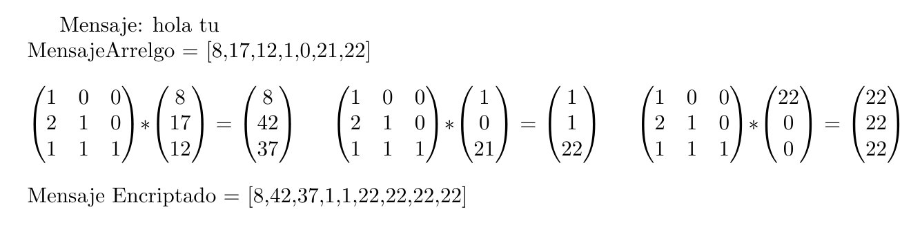
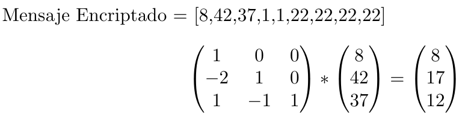

# Encriptador
Una pagina que encripta y desecripta un mensaje con la llave.

Así se ve la página: 

## Funcionamiento

La forma de encriptar el mensaje hace uso de Álgebra Lineal utilizando una propiedad de las matrices. Como sabemos en Álgebra Lineal el espacio vectorial de matrices de $A_m B_n$ en $\mathbb R$ la multiplicación de matrices no es conmutativa es decir:

$A_m * B_n \not= B_n * A_m$ 

Y esto pasa por la forma peculiar de multiplicar matrices, pero sabemos que existen matrices invertibles es decir conmuta la multiplicación solo pasa con  las matrices invertibles y no todas son matrices invertibles, existen ciertos criterios para poder invertir una matriz y un método para invertirla.

Sabiendo esto, es claro ver que  si tomamos una matriz invertible  sucede que: 

$a * a^{-1} = I,  a * a ^{-1} * b = a^{-1} * a * b = a^{-1}*(a*b)=b$

Ahora usando esta propiedad encriptaremos un mensaje convirtiendo la cadena de texto en numeros asignando a cada caracter un número único. Después tomaremos cada 3 elementos de la cadena y los haremos vectores columnas para multiplicar nuestra matriz invertible por un vector columna y si faltan espacios lo llenamos con ceros y ese sera nuestro mensaje encriptado. 
$A_m * B_n$

Ahora para desencriptar necesitaremos la llave y esa llave es nuestra matriz inversa. Como lo vimos en el ejemplo $a^{-1}*(a*b)=b$

 